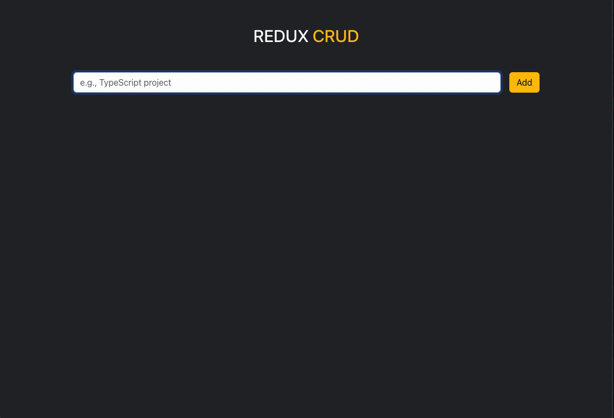

# React Todo App with Redux

A simple and intuitive Todo app built with React and Redux for state management. The app allows users to add, edit, delete, and manage their tasks effectively. It also incorporates third-party libraries like `axios`, `react-toastify`, and `bootstrap` for enhanced functionality and UI.

## Features

- Add new todos.
- Mark todos as completed.
- Delete todos.
- Edit existing todos.
- Redux for state management.
- Toast notifications for feedback.
- Fake backend using `json-server`.

## Gif

